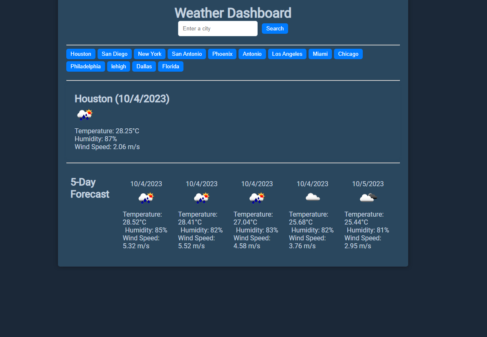

# Rays Weather Dashboard

## Description

My goal when working on this project was to help me learn about working with APIs and handling data.

The weather dashboard is a user friendly webpage used to help you plan out your day accordingly. 

Working on this was helpful because it helped me solidify my usage of APIs and fetch functions.

## Installation

1. Clone the repository to your local machine: https://github.com/Wolffkran/Rays_Weather_Dashboard.git

2. Navigate to the project directory: cd Rays_Weather_Dashboard

3. Open your web browser and visit /Rays_Weather_Dashboard/index.html to view the application.

## Usage

##Credits

https://openweathermap.org/

## License

© 2023 edX Boot Camps LLC. Confidential and Proprietary. All Rights Reserved.
